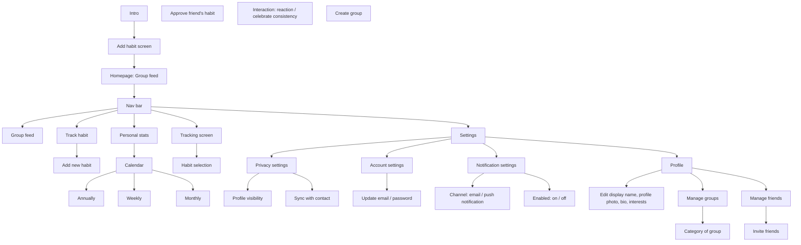

# 3 · Information architecture

Transcribed from `raw files/Information Architecture.png`.

**Notes**

- The homepage *is* the group feed; a nav bar fans out to Group feed, Track habit, Personal
  stats (→ Calendar: annually / weekly / monthly), Tracking screen (→ Habit selection) and Settings.
- "Approve friend's habit" and "Interaction: reaction / celebrate consistency" are called out
  as first-class concepts of the product, not buried screens.
