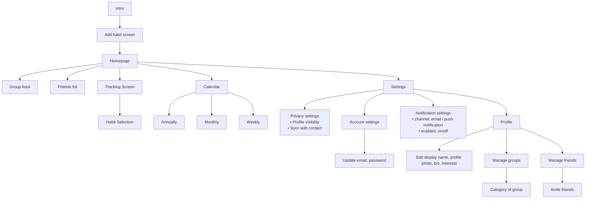

# 3 · Information architecture

Transcribed from the team's FigJam board (corrected version).

**Notes**

- Onboarding is Intro → Add habit → Homepage. The homepage fans out to Group feed, Friends
  list, the Tracking screen (→ Habit selection), Calendar (annually / monthly / weekly) and Settings.
- Settings holds Privacy, Account (→ update email/password), Notifications, and Profile
  (edit details, manage groups → category of group, manage friends → invite friends).
