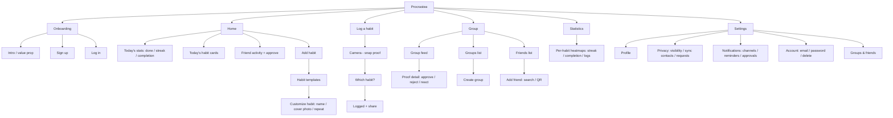

# 3 · Information architecture

> Reconstructed from the board's IA diagram (`design-source/figjam-board-full.png`) plus
> the realized wireframes. Labels are best-effort — **verify against the source**, especially
> the deeper Settings nodes which were low-resolution in the export.

_Verify labels against `design-source/figjam-board-full.png`._
