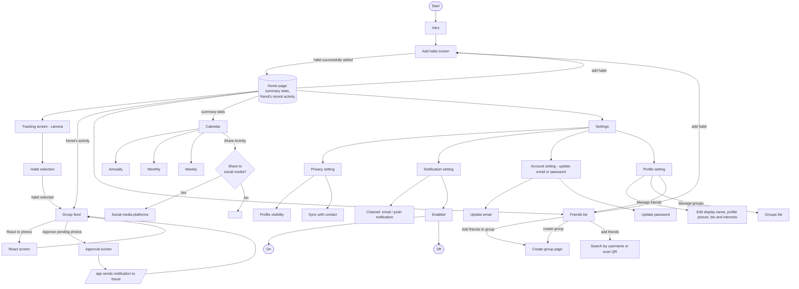

# 5 · User flow

Transcribed from `raw files/User Flow.png`. The board colour-codes sub-flows
(green = friends / groups, blue = settings, pink = stats → share).

**Notes / reconciliation with the wireframes**

- Onboarding is **Intro → Add habit → Home** (no separate sign-up/login step is drawn).
  The wireframe intro keeps a "log in" affordance, but the happy path adds a first habit immediately.
- After logging, the user lands on the **Group feed** (proof posted for the group).
  The wireframes add a short "Logged / share" confirmation before the feed — a superset, not a conflict.
- **Sharing to social media** happens from **Calendar → Share Activity**, not from the log step.
- **React** and **Approval** are separate screens here; the wireframes combine them into one
  "proof detail" screen. Flag if they should be split.
