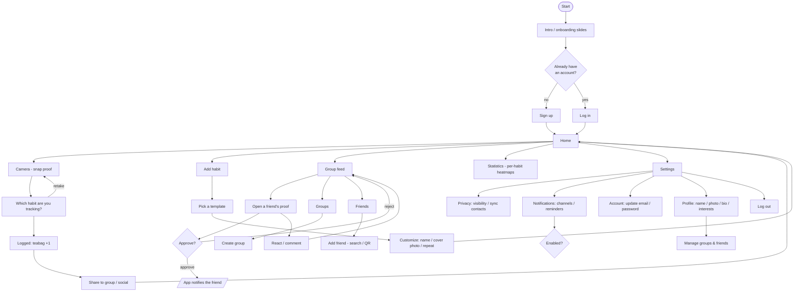

# 5 · User flow

> Reconstructed from the board's User Flow diagram (`design-source/figjam-board-full.png`)
> plus the realized wireframes. The board colour-codes several sub-flows (green = friends /
> approval, blue = settings, pink = auth). Labels are best-effort — **verify against the
> source**.

_Verify node labels and branch conditions against `design-source/figjam-board-full.png`._
